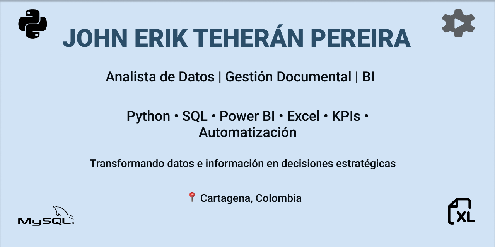

  

# 👋 Hola, soy John Erik Teherán Pereira

### 📊 Analista de Gestión Documental | Data Analyst | Power BI | Python | SQL

📍 Cartagena, Colombia

Profesional en Administración de Negocios Internacionales con más de 10 años de experiencia en gestión documental, control normativo y optimización de procesos administrativos.

Actualmente estoy fortaleciendo mi perfil como Analista de Datos, aplicando herramientas como Excel, Power BI, Python y SQL para convertir datos en información estratégica que apoye la toma de decisiones y la mejora continua de los procesos organizacionales.

---

## 🚀 Sobre mí

Combino experiencia en gestión documental y administración con análisis de datos para:

* 📈 Construcción y seguimiento de KPIs
* 📊 Desarrollo de dashboards interactivos
* ⚡ Automatización de reportes
* 🔍 Análisis y estructuración de información
* 🏢 Optimización de procesos administrativos
* 💡 Soporte a la toma de decisiones basada en datos
* 🔄 Transformación digital y mejora continua

---

## 🛠 Tecnologías y Herramientas

### 📊 Análisis de Datos

* Excel Avanzado
* Google Sheets
* Power BI
* Python
* SQL

### 📂 Gestión Documental

* TRD (Tablas de Retención Documental)
* TVD (Tablas de Valoración Documental)
* Gestión de Archivo
* Digitalización Documental
* Trazabilidad Documental
* Control Normativo

### 💻 Software Empresarial

* DocuWare
* ERP Siesa Uno E
* Microsoft Excel
* Power BI

### 💻 Entorno de Desarrollo Integrado (IDE)

* JupyterLab
* VS Code

---

## 📊 Proyecto Destacado

### Análisis del Mercado Laboral para Analistas de Datos

Proyecto desarrollado sobre más de 500 ofertas laborales para identificar tendencias y habilidades demandadas en el mercado de análisis de datos.

#### Actividades realizadas

* Limpieza y transformación de datos
* Análisis Exploratorio de Datos (EDA)
* Construcción de indicadores
* Visualización de datos
* Desarrollo de dashboards en Power BI
* Automatización de reportes en Excel

#### Tecnologías utilizadas

* Excel
* Power BI
* Python
* SQL

🔗 Repositorio:
https://github.com/Jhoneprez/analisis-mercado-analistas-datos

---

## 🎓 Formación Académica

* Tecnología en Análisis y Desarrollo de Software — SENA (2025)
* Especialización Tecnológica en Gestión de la Logística Internacional — SENA (2022)
* Administrador de Negocios Internacionales — Corposucre (2021)
* Tecnología en Gestión Logística — SENA
* Tecnología en Gestión Naviera y Portuaria — TECNAR

---

## 📜 Certificaciones

* SQL Interactivo — Academia Desafio Latam (2026)
* Introduccion a SQL — Academia Desafio Latam (2026)
* Python: de cero a usuario — Coursera (2026)
* Construccion de Bases de Datos con MYSQL — SENA(2026)
* IBM Avanzatec - Certificado de Analítica de datos con IBM (2026)
* IBM SkillsBuild Data Analytics Certificate (2026)
* Análisis de Datos Básico — Universidad Tecnológica de Bolívar (2025)
* Excel Avanzado — Open Academy Santander (2025)
* Excel Completo — Cedesarrollo Comfenalco (2024)

---

## 🎯 Objetivo Profesional

Consolidarme como Analista de Datos, integrando mi experiencia en gestión documental y procesos administrativos con herramientas de análisis, visualización y automatización para generar valor mediante el uso estratégico de la información.

---

## 📫 Contacto

📧 [jhoneprez@hotmail.com](mailto:jhoneprez@hotmail.com)

💼 LinkedIn:
[www.linkedin.com/in/john-erik-teheran-pereira-00120999](http://www.linkedin.com/in/john-erik-teheran-pereira-00120999)

📍 Cartagena, Colombia

⭐ Siempre aprendiendo sobre Análisis de Datos, Power BI, Python y SQL.
